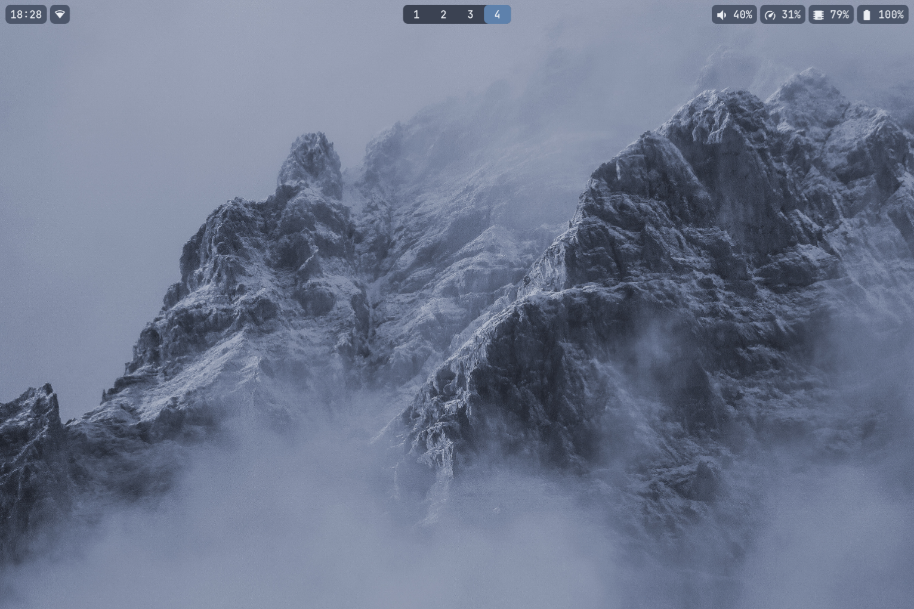
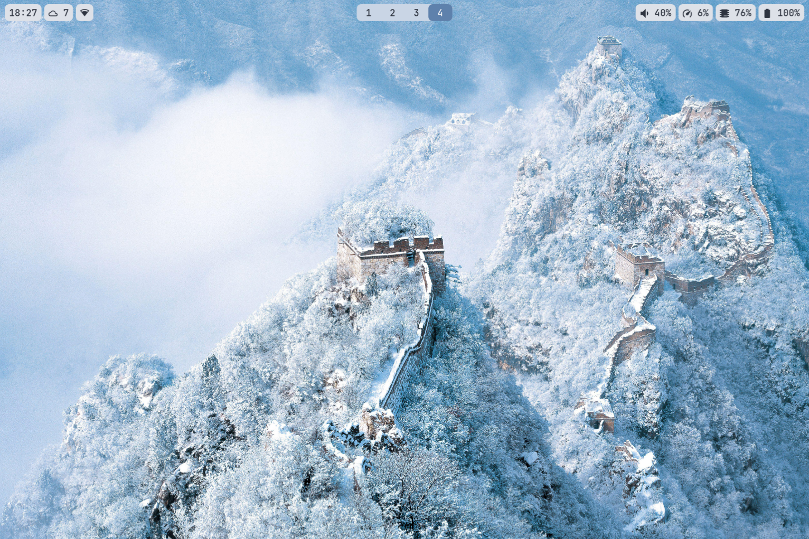

# Nord Dotfiles

My personal dotfiles for a Wayland desktop setup, themed with the [Nord color palette](https://www.nordtheme.com/).





## Features

- **Nord theming** - Consistent Nord colors across all components
- **Light/Dark toggle** - Theme switch script that updates wallpaper, waybar, kitty, rofi, VS Code, and more in one go
- **Waybar** - Custom status bar with CPU governor display, GPU stats, weather, and workspace icons
- **Lock screen** - Blurred lock with clock display (hyprlock/swaylock)
- **Idle management** - Screen dimming, auto-lock, and DPMS via hypridle
- **Notification scripts** - Battery warnings, volume/brightness OSD, keyboard layout indicator
- **Power menu** - Rofi-based menu for shutdown/reboot/hibernate/lock

## Scripts

Located in `.config/hypr/scripts/`:

| Script | Purpose |
|--------|---------|
| `theme_toggle.sh` | Switch between light and dark Nord themes system-wide |
| `power_menu.sh` | Rofi power menu |
| `battery_notify.sh` | Low battery warnings |
| `volume_notify.sh` | Volume change OSD |
| `brightness_notify.sh` | Brightness change OSD |
| `freeze_screenshot.sh` | Screenshot utility |
| `waybar_weather.sh` | Weather module for waybar |
| `toggle_screen_timeout.sh` | Disable/enable screen timeout |

## Dependencies

**Compositor:**
- [Hyprland](https://hyprland.org/)

**Bar & UI:**
- waybar
- rofi or wofi
- mako or dunst

**Lock & Idle:**
- hyprlock / swaylock
- hypridle / swayidle
- hyprpaper / swaybg

**Utils:**
- kitty (terminal)
- grimshot / grim + slurp (screenshots)
- brightnessctl
- pipewire + wireplumber

**Optional:**
- KDE Connect

## Installation

Clone and symlink what you need:

```bash
git clone https://github.com/BorretSquared/dotfiles_nord.git
cd dotfiles_nord

# Example: link hypr config
ln -sf $(pwd)/.config/hypr ~/.config/hypr

# Or link everything
ln -sf $(pwd)/.config/* ~/.config/
```

Make scripts executable:

```bash
chmod +x ~/.config/hypr/scripts/*.sh
chmod +x ~/.config/waybar/custom_modules/*.sh
```
## Notes

- Monitor scaling is set to 1.33x in hyprland.conf for a Surface Laptop Go 2 - adjust for your display.
- Theme toggle script touches multiple apps (VS Code, Kitty, Rofi, etc.) - remove entries for apps you don't use.
- Keybinds will be illogical on QWERTY because I use APTv3 as my layout.
- I havent managed to get firefox to reasonably change themes live, eventually will get this working.
 
## License

None.
